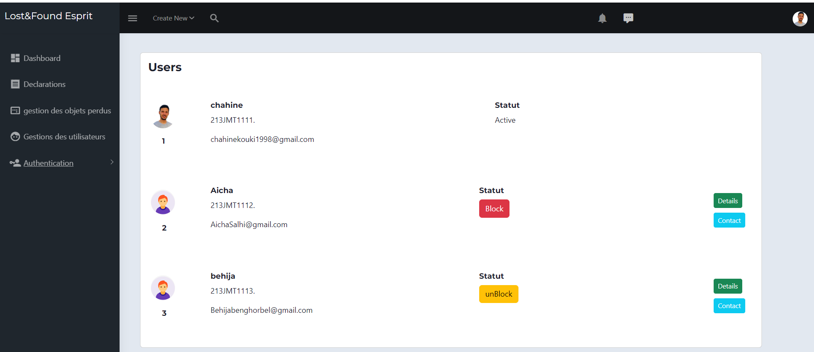

#Projet "LOST & FOUND" - Plateforme de Gestion des Objets Trouvés
Bienvenue dans le README du projet "LOST & FOUND", fruit d'un stage d'immersion captivant de 6 semaines au sein du groupe SSD Team. Ce projet novateur s'adresse spécifiquement aux étudiants de l'établissement ESPRIT,
offrant une solution dédiée à la recherche et à la récupération d'objets égarés au sein de l'école.
# Objectif du Projet
Le projet se concentre sur le développement d'une application web moderne, utilisant Spring Boot pour le backend, Angular pour le frontend, et une base de données MySQL pour 
assurer la robustesse du stockage des informations. Cette stack technologique promet une expérience utilisateur fluide et sécurisée.
# Déroulement du Stage
Réalisé en collaboration avec deux autres stagiaires au sein de l'équipe SSD, mon rôle passionnant consiste à implémenter le module de gestion des utilisateurs avec authentification. La sécurité est un aspect essentiel de notre approche,
et nous mettrons en valeur cette dimension à l'aide du framework Spring Security.
# Conception 
# 1-Architecture logique 
L'application "LOST & FOUND" adopte une architecture multi-couches pour garantir la modularité et la maintenabilité du code. Voici une vue d'ensemble de l'architecture logique :
.png)

controller: Gère les requêtes HTTP et les interactions avec le frontend.
service: Contient la logique métier de l'application.
impl: Implémente les services spécifiques.
repository: Gère l'accès à la base de données.
model: Définit les entités et les objets métier.
security: Gère la sécurité de l'application, utilisant Spring Security.
# 2-Architecture physique 

# Interfaces 
Liste des utilisateurs 

Details d'un utilisateur 

Interface de chat :
Chat instantannée impelementé avec avec les webSocket :


# Implementation d'un chat instantannée en utilisant Socket.io coté front end 
```javascript
// Your JavaScript code here
connectToChat() {
    const headers = { 'Authorization': 'Bearer my-token', 'My-Custom-Header': 'foobar' };
       const id1 = this.userAuthService.getUserId().replace('"','').replace('"','')!;
    const nick1 = this.userAuthService.getUserName().replace('"','').replace('"','');
    const id2 = this.otherUser?.id!;
    const nick2 = this.otherUser?.userFirstName!;

   if (id1.toLowerCase().localeCompare(id2.toLowerCase())==1) {
    this.channelName = nick1 + '&' + nick2;
    console.log("id1 "+id1+" superieur à id2 "+id2)
    console.log("channelname "+this.channelName);
  }
  else {
    this.channelName = nick2 + '&' + nick1;
    console.log("channelname "+this.channelName);
    console.log("id2 "+id2+" superieur à id1"+id1)
  }
    this.loadChat();
    this.socket = new SockJS(this.url + '/chat');
    console.log('connecting to chat...');
    this.stompClient = Stomp.over(this.socket);

    this.stompClient.connect({ 'Authorization': 'Bearer my-token', 'My-Custom-Header': 'foobar' }, (frame) => {
      //func = what to do when connection is established
      console.log('connected to: ' + frame);
      this.stompClient!.subscribe(
        '/topic/messages/' + this.channelName,
        (response) => {
          this.loadChat();
        }
      );
    });
  }

  sendMsg() {
    const headers = { 'Authorization': 'Bearer my-token', 'My-Custom-Header': 'foobar' };
    if (this.newMessage.value !== '') {
      this.stompClient!.send(
        '/app/chat/' + this.channelName,
        {header : headers},
        JSON.stringify({
          sender: this.userAuthService.getUserName(),
          t_stamp: 'to be defined in server',
          content: this.newMessage.value,
        })
      );
      this.newMessage.setValue('');
    }
  }

  loadChat(){

    this.messages = this.http.post<Array<Messaggio>>(this.url+'/getMessages' ,  this.channelName );
    this.messages.subscribe(data => {
      let mgs:Array<Messaggio> = data;
      mgs.sort((a, b) => (a.ms_id > b.ms_id) ? 1 : -1)
      this.messages = of(mgs);
    })
    console.log(this.messages);
  }

  whenWasItPublished(myTimeStamp: string) {
    const endDate = myTimeStamp.indexOf('-');
    return (
      myTimeStamp.substring(0, endDate) +
      ' at ' +
      myTimeStamp.substring(endDate + 1)
    );
  }


